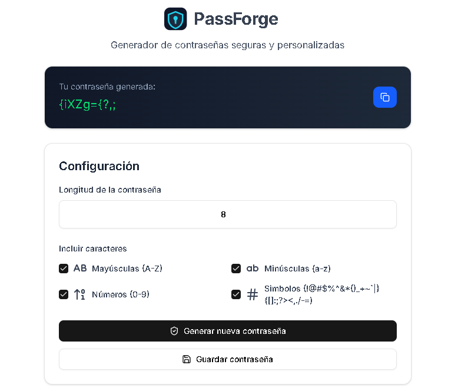
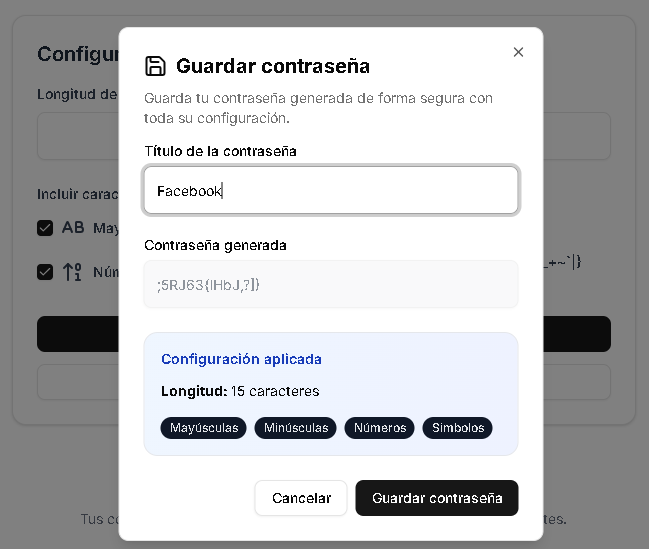
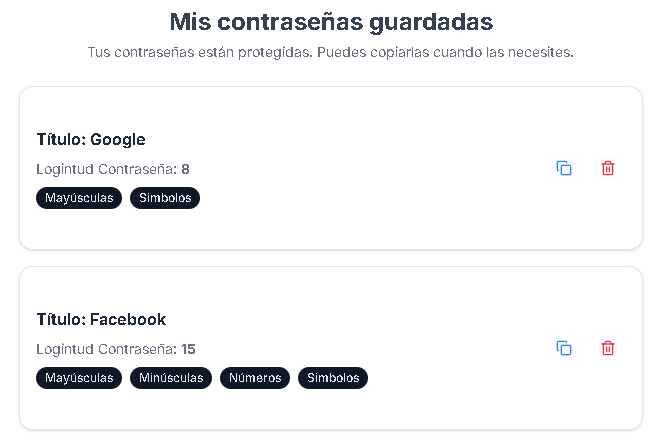

# PassForge

Generador de contraseñas seguras y personalizadas construido con Next.js 15, Prisma ORM y TanStack Query.



## Descripción

PassForge es una aplicación web full-stack que permite generar contraseñas seguras con configuraciones personalizables y almacenarlas de forma encriptada. La aplicación ofrece una interfaz intuitiva para crear, guardar y gestionar contraseñas con diferentes niveles de complejidad.

## Características

- Generación de contraseñas con configuración personalizable (longitud, mayúsculas, minúsculas, números, símbolos)
- Almacenamiento seguro de contraseñas con encriptación AES-256-GCM
- Interfaz moderna y responsiva con modo oscuro
- Gestión completa de contraseñas guardadas (crear, copiar, eliminar)
- Tooltips informativos para mejorar la experiencia de usuario
- Logo y favicon personalizados

## Capturas de Pantalla

### Generador de Contraseñas


### Guardar Contraseña


### Lista de Contraseñas Guardadas


## Tecnologías Utilizadas

### Frontend
- **Next.js 15** - Framework de React con App Router
- **React 19** - Biblioteca de interfaz de usuario
- **TypeScript** - Tipado estático
- **Tailwind CSS** - Framework de CSS utility-first
- **shadcn/ui** - Componentes de UI reutilizables
- **Radix UI** - Primitivas de UI accesibles
- **Lucide React** - Iconos
- **Sonner** - Notificaciones toast

### Backend
- **Next.js API Routes** - Endpoints del servidor
- **Prisma ORM** - ORM para base de datos
- **SQLite** - Base de datos (desarrollo)
- **crypto** - Encriptación nativa de Node.js

### Gestión de Estado
- **TanStack Query (React Query)** - Manejo de estado del servidor
- **React Hook Form** - Gestión de formularios
- **Zod** - Validación de esquemas

## Requisitos Previos

- Node.js 18.x o superior
- npm o yarn

## Instalación

1. Clona el repositorio:
```bash
git clone <url-del-repositorio>
cd password-generator
```

2. Instala las dependencias:
```bash
npm install
```

3. Configura las variables de entorno:
Crea un archivo `.env` en la raíz del proyecto con el siguiente contenido:
```env
DATABASE_URL="file:./dev.db"
ENCRYPTION_KEY="tu-clave-de-encriptacion-de-32-caracteres-aqui"
```

**Importante:** La `ENCRYPTION_KEY` debe ser una cadena de exactamente 32 caracteres para AES-256. Puedes generar una usando:
```bash
node -e "console.log(require('crypto').randomBytes(32).toString('hex').slice(0, 32))"
```

4. Configura Prisma:
```bash
npx prisma generate
npx prisma db push
```

5. Inicia el servidor de desarrollo:
```bash
npm run dev
```

6. Abre tu navegador en [http://localhost:3000](http://localhost:3000)

## Scripts Disponibles

- `npm run dev` - Inicia el servidor de desarrollo
- `npm run build` - Construye la aplicación para producción
- `npm start` - Inicia el servidor de producción
- `npm run lint` - Ejecuta el linter
- `npx prisma studio` - Abre Prisma Studio para gestionar la base de datos

## Estructura del Proyecto

```
password-generator/
├── app/
│   ├── (dashboard)/
│   │   ├── _actions/          # Server Actions
│   │   ├── _components/       # Componentes del dashboard
│   │   └── page.tsx           # Página principal
│   ├── layout.tsx             # Layout raíz
│   ├── globals.css            # Estilos globales
│   └── icon.svg               # Favicon
├── components/
│   ├── ui/                    # Componentes de shadcn/ui
│   └── logo.tsx               # Componente del logo
├── lib/
│   ├── password.ts            # Lógica de generación de contraseñas
│   ├── encryption.ts          # Funciones de encriptación
│   └── utils.ts               # Utilidades
├── prisma/
│   └── schema.prisma          # Esquema de la base de datos
└── public/
    └── screenshots/           # Capturas de pantalla
```

## Uso

### Generar una Contraseña

1. Ajusta la longitud de la contraseña usando el campo numérico
2. Selecciona los tipos de caracteres que deseas incluir (mayúsculas, minúsculas, números, símbolos)
3. Haz clic en "Generar nueva contraseña"
4. Copia la contraseña generada usando el botón de copiar

### Guardar una Contraseña

1. Después de generar una contraseña, haz clic en "Guardar contraseña"
2. Ingresa un título descriptivo (ej: "Facebook", "Gmail")
3. Opcionalmente, añade un nombre de usuario
4. Haz clic en "Guardar contraseña"

### Gestionar Contraseñas Guardadas

- **Copiar:** Haz clic en el icono azul de copiar para copiar la contraseña al portapapeles
- **Eliminar:** Haz clic en el icono rojo de eliminar y confirma la acción

## Seguridad

Las contraseñas se almacenan encriptadas usando el algoritmo AES-256-GCM. Cada contraseña tiene:
- Un vector de inicialización (IV) único
- Una etiqueta de autenticación para verificar la integridad
- Encriptación con una clave de 256 bits

**Nota:** Para uso en producción, considera usar una base de datos más robusta (PostgreSQL, MySQL) y almacenar la clave de encriptación en un servicio de gestión de secretos.

## Recursos

- [Documentación de Next.js](https://nextjs.org/docs)
- [Documentación de Prisma](https://www.prisma.io/docs/guides/nextjs)
- [Documentación de TanStack Query](https://tanstack.com/query)
- [Documentación de shadcn/ui](https://ui.shadcn.com)

## Licencia

Este proyecto es de código abierto y está disponible bajo la licencia MIT.
